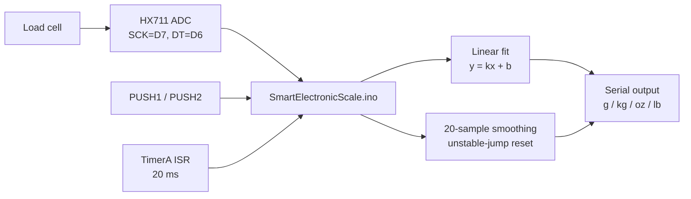
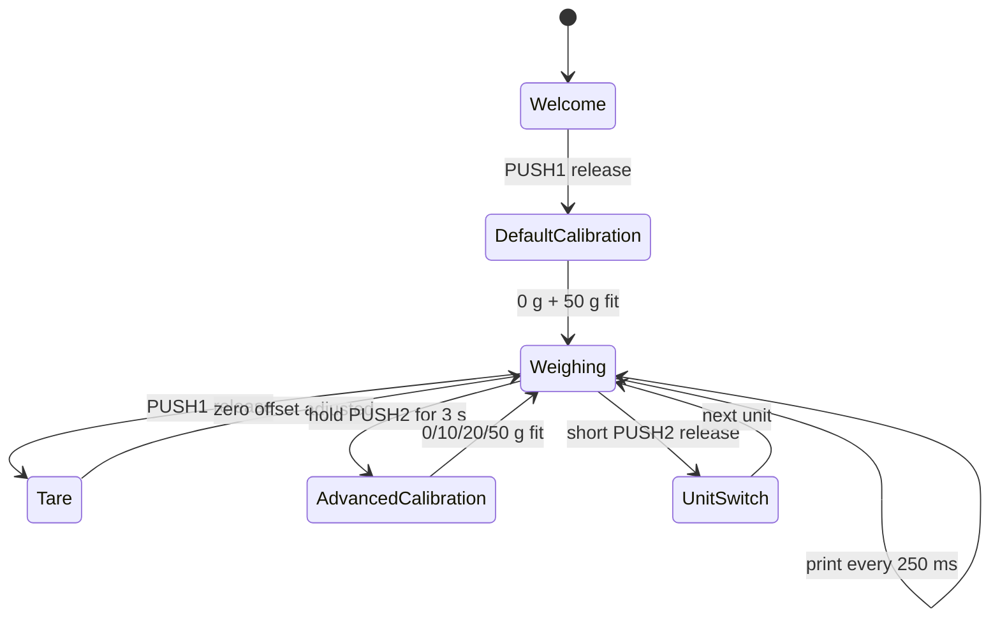

# Smart Electronic Scale Based on Energia / 基于 Energia 的智能电子秤

<p align="center">
  <strong>Energia + HX711 electronic-scale prototype with calibration, tare, unit switching, and serial weight output.</strong><br />
  HX711 load-cell ADC · PUSH1/PUSH2 interaction · TimerA scheduling · sliding-window smoothing
</p>

<p align="center">
  <a href="#中文">中文</a>
  ·
  <a href="#english">English</a>
  ·
  <a href="https://github.com/Cyh29hao/smart-electronic-scale-based-on-Energia">Repository</a>
</p>

<p align="center">
  
  
  
  
</p>

> Snapshot: 2026-07-05, UTC+8. This README is based on the local Energia experiment source selected for public release. The original state diagram containing personal metadata is not published; a clean Mermaid version is rebuilt in `docs/state-machine.md`.

## Project Map





## Quick Facts

| Item | Current state |
| --- | --- |
| Project type | Energia smart-scale prototype |
| Main sketch | `SmartElectronicScale/SmartElectronicScale.ino` |
| Sensor interface | HX711 load-cell ADC, `SCK=D7`, `DT=D6` in the current sketch |
| Inputs | `PUSH1` for continue / tare, `PUSH2` for unit switching or advanced calibration |
| Output | Serial Monitor at 9600 bps |
| Calibration | Default two-point fit with 0 g and 50 g; advanced four-point fit with 0 g, 10 g, 20 g, and 50 g |
| Units | `g`, `kg`, `oz`, `lb` |
| License | MIT |

<a id="中文"></a>

<details open>
<summary><strong>中文说明</strong></summary>

## 项目定位

这是一个基于 Energia 的家用电子秤快速原型。它使用 HX711 读取称重传感器数据，通过线性拟合把 ADC 读数映射为重量，并用板载按键完成欢迎确认、默认校准、去皮、进阶校准和单位切换。

## 当前进展

仓库整理为可直接打开的 Energia sketch：

- `SmartElectronicScale.ino`：电子秤交互、标定、滤波、单位切换和串口输出主逻辑。
- `HX711.cpp` / `HX711.h`：24 位 HX711 读数驱动，A 通道 128 增益。
- `Timer.cpp` / `Timer.h`：TimerA 周期中断工具，本项目用于 20 ms 节拍调度。
- `docs/state-machine.md`：从源码重建的公开状态机说明。

## 功能说明

| 功能 | 实现方式 |
| --- | --- |
| 默认校准 | 启动后提示清空秤盘，再放置 50 g 砝码，做两点线性拟合 |
| 实时称重 | 读取 HX711，应用 `y = kx + b`，串口输出三位有效数字 |
| 平滑显示 | 保留 20 个历史重量样本，稳定时输出滑动均值；突变超过 0.5 g 时重置窗口 |
| 去皮 / 归零 | `PUSH1` 释放触发，调整偏置 `b` |
| 进阶校准 | `PUSH2` 长按 3 秒触发，使用 0 g / 10 g / 20 g / 50 g 四点拟合 |
| 单位切换 | `PUSH2` 短按释放触发，在 g、kg、oz、lb 间循环 |

## 技术结构

```text
SmartElectronicScale/
├─ SmartElectronicScale.ino   # scale workflow, calibration, filtering, serial output
├─ HX711.cpp                  # HX711 bit-bang read implementation
├─ HX711.h                    # HX711 helper class
├─ Timer.cpp                  # TimerA setup and interrupt vector
└─ Timer.h                    # Timer helper declaration
```

关键实现点：

- `HX711::HX711_Read()` 读取 24 位数据，并通过额外时钟脉冲选择 A 通道 128 增益。
- `Linear_Fit()` 用最小二乘法根据参考砝码数据更新 `k` 和 `b`。
- `Button` 类封装按下、释放、长按计时和交互提示。
- `Weight_Update()` 用滑动窗口抑制抖动，同时在明显突变时快速重建参考窗口。
- `Print_Significant()` 在不依赖复杂格式化库的情况下输出三位有效数字。

## 本地运行

1. 安装 Energia，并准备兼容的 TI LaunchPad 风格开发板。
2. 将 HX711 连接到当前 sketch 使用的引脚：`SCK=D7`，`DT=D6`。
3. 打开 `SmartElectronicScale/SmartElectronicScale.ino`。
4. 选择开发板和串口，上传程序。
5. 打开 Serial Monitor，波特率设为 `9600`。
6. 按串口提示完成空秤和砝码校准；进入称重状态后用 `PUSH1` 去皮，用 `PUSH2` 短按切换单位，长按 3 秒进入进阶校准。

## 边界与注意事项

- 标定参数只保存在运行时变量中，断电或重启后需要重新校准。
- 串口输出是当前主要显示方式；仓库不包含 LCD/OLED 显示界面。
- 该项目是课程原型，不是计量认证电子秤，也没有温漂补偿、长期漂移校准或外壳结构设计。
- 本次公开不包含课程报告、任务书或含个人标识信息的原始状态图。

## 下一步路线

- 将校准参数保存到非易失存储，减少每次启动的校准步骤。
- 增加显示屏输出和更完整的错误提示。
- 抽出可复用的按钮事件、滤波和校准模块。
- 加入串口命令，支持手动设置砝码重量和单位。

## 开源协议

MIT License. See `LICENSE`.

</details>

<a id="english"></a>

<details>
<summary><strong>English</strong></summary>

## What This Is

This is an Energia-based smart electronic scale prototype using an HX711 load-cell ADC. It supports startup calibration, tare, advanced calibration, unit switching, smoothing, and serial weight output.

## Current Feature Set

- HX711 24-bit ADC read helper for load-cell input.
- Default two-point calibration with 0 g and 50 g reference weights.
- Advanced four-point calibration with 0 g, 10 g, 20 g, and 50 g references.
- Tare / zero-offset recalibration through `PUSH1`.
- Unit switching among grams, kilograms, ounces, and pounds through `PUSH2`.
- 20-sample smoothing window with reset-on-jump behavior.
- Serial Monitor output at 9600 bps.

## Repository Layout

```text
SmartElectronicScale/
├─ SmartElectronicScale.ino
├─ HX711.cpp
├─ HX711.h
├─ Timer.cpp
└─ Timer.h
docs/
├─ publication-boundary.md
└─ state-machine.md
```

## Run Locally

Open `SmartElectronicScale/SmartElectronicScale.ino` in Energia, connect HX711 with `SCK=D7` and `DT=D6`, select a compatible board and port, upload the sketch, then open Serial Monitor at `9600` bps. Follow the prompts for calibration and button interaction.

## Boundaries

This is a coursework prototype, not a certified measuring instrument. Calibration is not persisted after power-off, and the repository intentionally excludes course reports plus the original local diagram that contained personal metadata.

## License

MIT License. See `LICENSE`.

</details>
