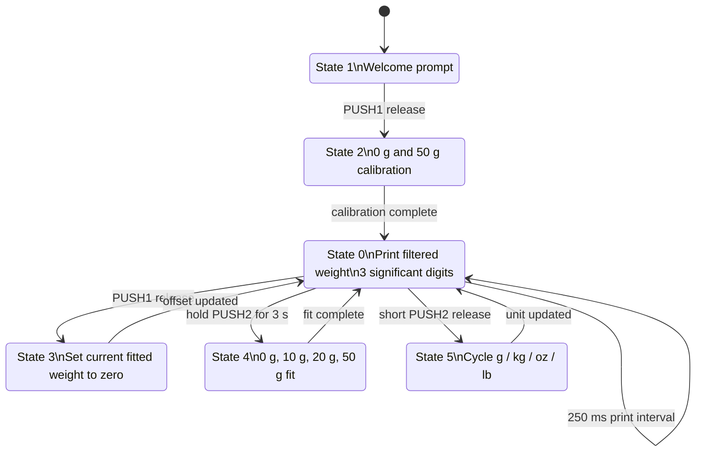

# Smart Electronic Scale State Machine / 智能电子秤状态机

The public diagram below is reconstructed from `SmartElectronicScale/SmartElectronicScale.ino` so the repository can explain the workflow without publishing the original local diagram that contained personal metadata.

## Interaction Summary

| Trigger | Result |
| --- | --- |
| Startup | Print welcome text, then wait for `PUSH1` release |
| Default calibration | Read empty scale and 50 g reference, then fit `y = kx + b` |
| `PUSH1` release during weighing | Tare / recalibrate the zero offset |
| `PUSH2` held for 3 s | Enter advanced calibration with 0 g, 10 g, 20 g, and 50 g references |
| Short `PUSH2` release | Switch display unit among `g`, `kg`, `oz`, and `lb` |
| 250 ms timer interval | Print the latest filtered weight over serial |
